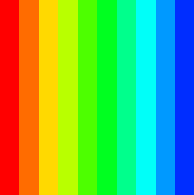
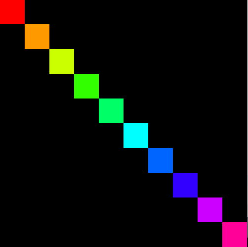
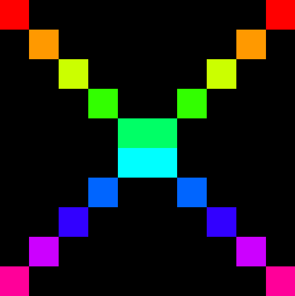
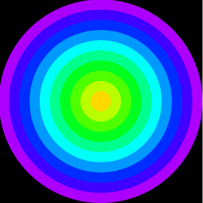
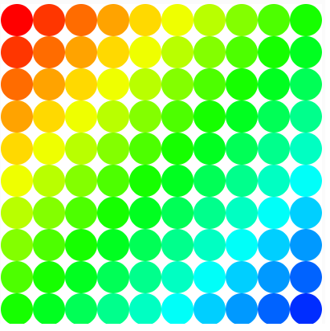
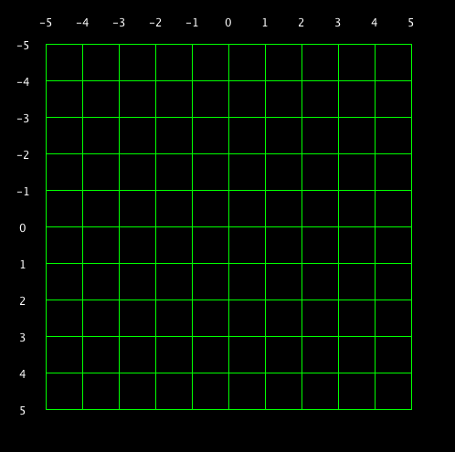
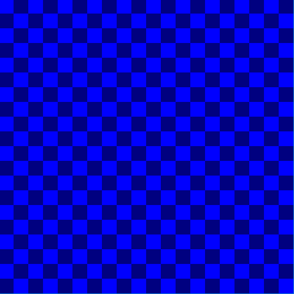
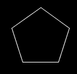
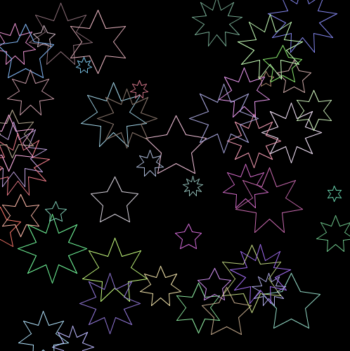

# Creative Coding for Game Design 2026

```
Greetings fellow octopus
```

# Assessment
- End of year programming test 33%
- Weekly engagement mark 33%
- [Assignment 33% - Due](assignment.md)

# Notes
- [Godot 2D & 3D Essentials](notes/godot%20intro.pdf)
- [GDScript Comprehensive](notes/gdscript.pdf)

# Resources
- [FOSSIKAL](https://github.com/skooter500/csresources/blob/main/foss_resources.md)
- [CSResources git repo](https://github.com/skooter500/csresources/blob/main/git_ref.pdf). Here you will find links to the previous courses and all my quick references
- [Git for poets](https://www.youtube.com/watch?v=BCQHnlnPusY)
- [Godot for beginners](https://www.youtube.com/watch?v=LOhfqjmasi0)
- [GDScript Tutorial](https://www.youtube.com/watch?v=e1zJS31tr88)
- [5 Games Made in Godot to inspire you each week](https://www.youtube.com/@stayathomedev) 
- [Class Discord](https://discord.gg/k5FE4GKmF)

### Lab - Drawing with Code

### Learning Outcomes
- Godot workflows
- Creatinve problem solving and analysis
- Creating a visual system from code
- Undetstanding the relationship between color and shapes and code
- For loop
- if statement
- Computational thinking

Use the functions in _draw() to create the following patterns:





















Try these if statement exercises:

[](https://www.youtube.com/watch?v=18kMOeygmHA)

Import some sprites and get them moving around!

Check out any of the Godot projects on [my github repo](http://github.com/skooter500) for ideas.


[](https://www.youtube.com/watch?v=18kMOeygmHA)

Take screenshots of whatever you create share on discord, upload to Brightspace to get your engagement mark.


## Week 2 - Intro to Godot

- Godot 2D and 3D examples
- Godot 2D nodes
- Movement and rotation
- 2D Drawing primitives
- 2D Colors
- Using variables
- [Playlists of previous Godot projects](https://www.youtube.com/@skooter500/playlists)


## Week 1 - Intro to the course
- Yoga for programmers
- Creativity
- Intro to Godot and the course

