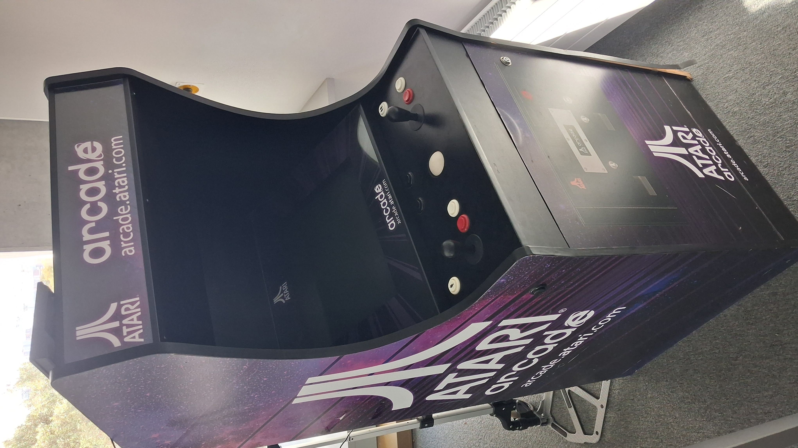

# Creative Coding 2026 Game Design

## Project Brief

### Shamrock Arcade Machines

Your Commission:

Congratulations! You have been hired as a junior game designer for Shamrock Arcade Machines, an Irish Company producing bespoke, handmade arcade cabinates for the rich and famous. We need games to showcase our new product and we need YOU to make one.

The brief!

Create a 2D vector graphics game to run on this arcade machine. 

Your game should:

- Take input from the buttons and joysticks on the machine
- Have a splash screen with titles
- Have gameplay

Take inspiration from vector graphics games and user interfaces from the 1960's - 2000. 

- https://www.youtube.com/watch?v=smStEPSRKBs
- https://www.youtube.com/watch?v=m1k6ZKvI4Ck
- https://www.youtube.com/watch?v=VtsD3O7w4DU
- https://www.youtube.com/watch?v=02jJRolMXUo&list=PL1n0B6z4e_E7lhCtkuacS_KvBORRHaR9E
- https://skooter500.itch.io/nill
- https://skooter500.itch.io/yasc
- [Tron](https://www.youtube.com/watch?v=EtyHX7z8fi8)
- [The Last StarFighter](https://www.youtube.com/watch?v=4R2UFlSc4mI)
- [Elite](https://en.wikipedia.org/wiki/Elite_(video_game))

Your game style is "retro-futurism" - what the future (now) looked like from the past. Much of this style comes from vector graphics. Vector grapics, schematics and diagrams can be geometric, beautiful, minimalist and pure. Use this visual style to communicate the elements of your game. Imagine how it felt as a player in the 1980 putting a coin into the machine and experiencing the future!

- **You do not need to be a great programmer or artist.**  Effort, creativity and originality will be rewarded. You are free to come up with your own gameplay and story. #

## Submission Requirements
- Submit initial proposal on Brightspace 10% pass or fail - ungraded
- Submit final game on Brightspace
- Live demo
- Documentation file
- YouTube video (optional)
- itch.io (optional)
- github (optional)

## Rubric

Your grade is made up of four parts. Read each row and ask yourself "which box does my game fit in?". You do not need to hit every single thing in a category to get that grade. The A column is an outstanding project, *not a checklist*!

| | A | B | C | D | E |
|---|---|---|---|---|---|
| **Gameplay & depth** | Game is fun to play. Clear goal, challenge that ramps up, and a way to win or lose. Several distinct things to do (e.g. move, shoot, dodge, collect, power-ups). Scoring, lives or a timer. 2 player mode. Every button and joystick on the machine does something useful. Thoroughly play-tested and balanced. | A solid, playable game with a clear goal and a win or lose condition. Scoring works. Uses the joystick and most of the buttons. A couple of mechanics that work together. Some bugs but nothing that breaks the game. | A simple game loop: you can control something, something happens, and it can end. Uses the joystick and at least one button. May be a single scene. Rough edges but it plays. | A Godot project that runs and responds to input, but there is not really a game yet - no goal, no way to end, or a lot of it is from a tutorial with little changed. | Nothing submitted, or the project does not open or crashes on start. |
| **Code & engine use** | Lots of your own GDScript, organised into reusable scenes and scripts. Good use of Godot systems: signals, tweens, timers, particles, groups, scene switching. Things like enemies, bullets or pickups are their own subscenes. Code is readable with sensible names and a few comments. Can explain any line of it. | Several scripts you wrote yourself. Uses signals and at least a couple of Godot systems (tweens, timers, particles). Splits the game into a few scenes. Code is mostly tidy and you can explain how it works. | A few scripts, mostly in one scene. Uses the basics from the labs (input, movement, `_draw()`, collisions). Some copied code but you understand it. | Minimal self-written code. Mostly a lab example or tutorial with small changes. Struggles to explain how it works. | No code, or code that does not run. |
| **Look, sound & feel** | The retro-futurist vector style is perfected. Everything is drawn from code and built from  shapes and lines. Original designs for game elements, UI and title screen. Your own sounds and music (made, recorded or synthesised). Juice: tweens, screen shake, particles, flashes, glow or post-processing. | A clear, consistent vector look with mostly original artwork. Title screen fits the theme. Sound effects on the main actions. Some tweens or particles to add feel. A few assets from online sources, credited. | Recognisable attempt at the vector style. Basic title screen. Some sound. Mixed original and downloaded assets. Little in the way of juice. | Default Godot look, or a mix of styles that does not match the brief. No title screen or no sound. Mostly downloaded assets. | No visuals or sound of your own. |
| **Demo & documentation** | Confident live demo: you play the game on the machine, show the features, and talk about how you built it and what you learned. Documentation file has everything: what the game is, how to play, screenshots, what you built yourself, what you borrowed (with links), and a reflection. Bonus flair: itch.io page, YouTube video, public GitHub repo with a README. | Good live demo that shows the game working and covers how you built it. Documentation covers what the game is, how to play, what you made and what you borrowed. Minor gaps. | Demo happens but is rushed or the game is not shown on the machine. Documentation is present but missing sections or screenshots. | Demo very brief or the game fails during it. Documentation is a few lines. | No demo, or no documentation. |

### What the grades mean

- **A** - Outstanding. Went well beyond the brief. You would be happy to put this on your portfolio as-is.
- **B** - Very good. Everything in the brief is done properly and the game is enjoyable.
- **C** - Good. The brief is met. The game works and is your own.
- **D** - Pass. Something was submitted and runs, but a lot of the brief is missing.
- **E** - Fail. Nothing submitted, or it does not run.

### How to do well

- **Get something playable early.** A tiny game that works. Add things to it every week.
- **Make it yours.** Draw your own shapes, make your own sounds, tweak the gameplay until it feels good. Original and simple beats copied and complex.
- **Use the machine.** Test on the actual arcade cabinet, not just the keyboard. Make the joystick and buttons feel good.
- **Show your work.** Take screenshots as you go. Keep a few dev notes. It makes the documentation and the demo much easier.
- **Ask for help.** If you are stuck, ask in class or in the lab. I am a highly paid senior lecturer at your disposal every week!
- **You do not need to be a great programmer or artist.**  Effort and creativity will be rewarded.
- [Godot code of conduct applies](https://godotengine.org/code-of-conduct/)
